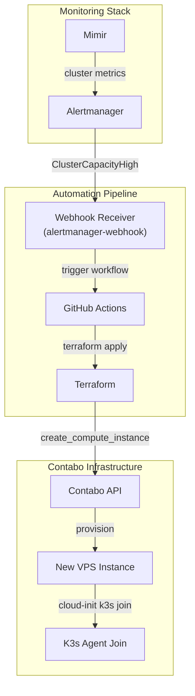
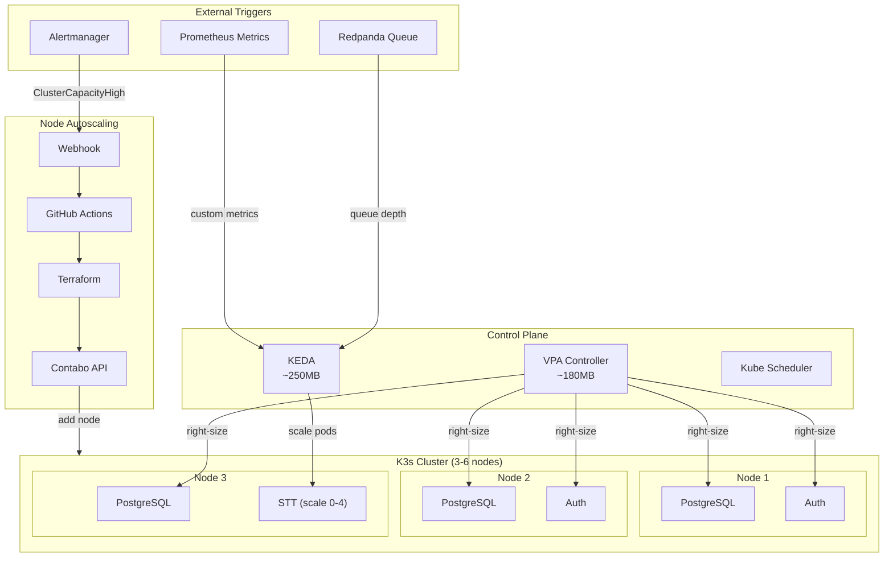

# ADR-030: Kubernetes Workload Management (VPA/KEDA/PDB/Topology/Node Autoscaling)

## Status
**Accepted** (Updated)

## Date
2026-01-08

## Context

Talent Mesh runs on a resource-constrained 3-node K3s cluster on Contabo VPS (12 vCPU, 24GB RAM, 600GB SSD). To ensure:
1. **Efficient resource utilization** - pods use what they need, not more
2. **High availability** - services survive node failures
3. **Operational stability** - maintenance operations don't cause outages
4. **Cost optimization** - avoid over-provisioning on tight budget
5. **Event-driven scaling** - scale based on queue depth, not just CPU
6. **Scale to zero** - save resources when AI services are idle
7. **Node scaling** - add/remove Contabo VPS nodes based on demand

We need a comprehensive workload management strategy covering pod autoscaling, node autoscaling, disruption handling, and topology distribution.

## Decision

### 1. Vertical Pod Autoscaler (VPA) - Resource Right-Sizing for ALL Workloads

**Strategy: "Start Small, Let VPA Decide"**

VPA with **UpdateMode: Auto** for ALL workloads (including StatefulSets) to:
- Start with minimal resource requests
- Let VPA observe actual usage and adjust
- PDB ensures availability during restarts

**VPA is safe for StatefulSets because:**
- All StatefulSets have 3 replicas
- PDB minAvailable: 2 ensures quorum during VPA restarts
- VPA restarts one pod at a time, respecting PDB

```yaml
apiVersion: autoscaling.k8s.io/v1
kind: VerticalPodAutoscaler
metadata:
  name: auth-service-vpa
  namespace: platform-services
spec:
  targetRef:
    apiVersion: apps/v1
    kind: Deployment
    name: auth-service
  updatePolicy:
    updateMode: "Auto"
    minReplicas: 2  # Keep 2 running during restarts
  resourcePolicy:
    containerPolicies:
      - containerName: auth-service
        minAllowed:
          cpu: 50m
          memory: 64Mi
        maxAllowed:
          cpu: 1000m
          memory: 1Gi
        controlledResources: ["cpu", "memory"]
        controlledValues: RequestsAndLimits
```

**VPA Coverage:**

| Workload Type | VPA Mode | Replicas | PDB minAvailable | Notes |
|---------------|----------|----------|------------------|-------|
| **Stateless Services** | Auto | 2-6 | 1 | Full automation |
| **StatefulSets (PostgreSQL)** | Auto | 3 | 2 | Safe with PDB |
| **StatefulSets (MongoDB)** | Auto | 3 | 2 | Safe with PDB |
| **StatefulSets (Dragonfly)** | Auto | 3 | 2 | Safe with PDB |
| **DaemonSets** | Off | 1/node | N/A | Fixed per-node |
| **Infrastructure** | Off | varies | varies | Stable needs |

**Initial Resource Requests (Minimal Starting Points):**

| Service | Initial CPU | Initial Memory | Max CPU | Max Memory |
|---------|-------------|----------------|---------|------------|
| **Platform Services** |
| Auth Service | 50m | 64Mi | 500m | 512Mi |
| User Service | 50m | 64Mi | 500m | 512Mi |
| Assessment Service | 100m | 128Mi | 1000m | 1Gi |
| Scheduling Service | 50m | 64Mi | 300m | 256Mi |
| Scoring Service | 100m | 128Mi | 500m | 512Mi |
| Matching Service | 100m | 128Mi | 500m | 512Mi |
| Notification Service | 50m | 64Mi | 300m | 256Mi |
| **AI Services** |
| Signaling Service | 50m | 32Mi | 500m | 256Mi |
| STT Service | 500m | 1Gi | 2000m | 3Gi |
| TTS Service | 100m | 128Mi | 500m | 256Mi |
| LLM Gateway | 100m | 256Mi | 500m | 512Mi |
| **StatefulSets** |
| PostgreSQL | 200m | 512Mi | 1000m | 2Gi |
| MongoDB | 200m | 512Mi | 1000m | 2Gi |
| Dragonfly | 100m | 256Mi | 500m | 1Gi |

### 2. KEDA - Event-Driven Pod Autoscaling (Replaces HPA)

**We use KEDA instead of HPA for:**
- Scale to zero capability (save ~3GB when AI services idle)
- Event-driven scaling (Redpanda queue depth, WebSocket connections)
- No conflict with VPA (KEDA uses external metrics, not CPU)

**KEDA vs HPA Comparison:**

| Feature | HPA | KEDA |
|---------|-----|------|
| Scale to zero | ❌ No (min 1) | ✅ Yes |
| Event-driven | Limited | ✅ 50+ scalers |
| Redpanda/Kafka | Needs adapter | ✅ Native |
| VPA conflict | ⚠️ CPU-based | ✅ None |
| Memory overhead | 0 (built-in) | ~250MB |

**Net resource savings:**
- KEDA overhead: +250MB
- AI idle savings: -3.2GB (scale to zero)
- **Net savings during off-peak: ~3GB**

**KEDA Configuration:**

```yaml
apiVersion: keda.sh/v1alpha1
kind: ScaledObject
metadata:
  name: stt-service-scaler
  namespace: ai-services
spec:
  scaleTargetRef:
    name: stt-service
  minReplicaCount: 0          # Scale to zero!
  maxReplicaCount: 4
  cooldownPeriod: 300         # 5 min before scale to zero
  pollingInterval: 15         # Check every 15s
  triggers:
    - type: kafka
      metadata:
        bootstrapServers: redpanda.databases:9092
        consumerGroup: stt-consumers
        topic: audio-processing
        lagThreshold: "5"     # Scale up when 5+ messages
---
apiVersion: keda.sh/v1alpha1
kind: ScaledObject
metadata:
  name: assessment-service-scaler
  namespace: platform-services
spec:
  scaleTargetRef:
    name: assessment-service
  minReplicaCount: 2          # Always keep 2 running
  maxReplicaCount: 6
  cooldownPeriod: 300
  triggers:
    - type: prometheus
      metadata:
        serverAddress: http://mimir.monitoring:9009
        metricName: active_assessments
        query: sum(active_assessments{service="assessment"})
        threshold: "6"        # Scale up at 6 active assessments
```

**KEDA Scalers by Service:**

| Service | Min | Max | Scaler Type | Trigger |
|---------|-----|-----|-------------|---------|
| Assessment Service | 2 | 6 | Prometheus | active_assessments > 6 |
| Signaling Service | 2 | 6 | Prometheus | active_connections > 100 |
| STT Service | 0 | 4 | Kafka | audio-processing lag > 5 |
| TTS Service | 0 | 4 | Kafka | text-synthesis lag > 5 |
| LLM Gateway | 0 | 3 | Kafka | llm-requests lag > 3 |
| Auth Service | 2 | 4 | Prometheus | requests_per_second > 100 |
| Notification Service | 0 | 3 | Kafka | notifications lag > 10 |

**Services without KEDA (fixed replicas):**
- User Service (2 replicas) - low, steady traffic
- Scheduling Service (2 replicas) - booking operations
- Scoring Service (2 replicas) - batch processing
- Matching Service (2 replicas) - periodic job

### 3. Terraform-Based Node Autoscaling

Contabo doesn't have native Kubernetes cluster autoscaler support. We implement **Terraform + Alerting** for semi-automatic node scaling.

**Architecture:**



**Alertmanager Rules:**

```yaml
# prometheus-rules.yaml
groups:
  - name: cluster-scaling
    rules:
      - alert: ClusterCapacityHigh
        expr: |
          (
            1 - (
              sum(node_memory_MemAvailable_bytes) /
              sum(node_memory_MemTotal_bytes)
            )
          ) > 0.80
        for: 10m
        labels:
          severity: warning
          action: scale_up
        annotations:
          summary: "Cluster memory usage above 80% for 10 minutes"
          runbook: "Trigger Terraform to add node"

      - alert: ClusterCapacityLow
        expr: |
          (
            1 - (
              sum(node_memory_MemAvailable_bytes) /
              sum(node_memory_MemTotal_bytes)
            )
          ) < 0.30
        for: 30m
        labels:
          severity: info
          action: scale_down
        annotations:
          summary: "Cluster memory usage below 30% for 30 minutes"
          runbook: "Consider removing a node"

      - alert: ClusterCPUHigh
        expr: |
          (
            1 - avg(rate(node_cpu_seconds_total{mode="idle"}[5m]))
          ) > 0.80
        for: 10m
        labels:
          severity: warning
          action: scale_up
```

**Terraform Configuration:**

```hcl
# terraform/environments/contabo-europe/main.tf

variable "node_count" {
  description = "Number of K3s nodes"
  type        = number
  default     = 3
}

variable "node_config" {
  description = "VPS configuration"
  type = object({
    type     = string
    region   = string
    image_id = string
  })
  default = {
    type     = "VPS 10"  # 4 vCPU, 8GB RAM, 200GB SSD
    region   = "EU"
    image_id = "ubuntu-22.04"
  }
}

resource "contabo_instance" "k3s_node" {
  count = var.node_count

  display_name = "talent-mesh-node-${count.index + 1}"
  product_id   = var.node_config.type
  region       = var.node_config.region
  image_id     = var.node_config.image_id

  user_data = templatefile("${path.module}/cloud-init.yaml", {
    node_index    = count.index
    k3s_token     = var.k3s_token
    k3s_server_ip = count.index == 0 ? "" : contabo_instance.k3s_node[0].ip_config[0].v4[0].ip
    node_labels   = "node-role=worker,node-index=${count.index}"
  })
}

output "node_ips" {
  value = [for node in contabo_instance.k3s_node : node.ip_config[0].v4[0].ip]
}
```

**GitHub Actions Workflow:**

```yaml
# .github/workflows/cluster-scale.yaml
name: Cluster Auto-Scale

on:
  repository_dispatch:
    types: [scale_up, scale_down]

jobs:
  scale-cluster:
    runs-on: ubuntu-latest
    steps:
      - uses: actions/checkout@v4

      - name: Setup Terraform
        uses: hashicorp/setup-terraform@v3

      - name: Decrypt secrets
        run: |
          sops -d terraform/environments/contabo-europe/terraform.tfvars.enc \
            > terraform/environments/contabo-europe/terraform.tfvars

      - name: Get current node count
        id: current
        run: |
          cd terraform/environments/contabo-europe
          terraform init
          COUNT=$(terraform output -raw node_count 2>/dev/null || echo "3")
          echo "count=$COUNT" >> $GITHUB_OUTPUT

      - name: Calculate new count
        id: new
        run: |
          CURRENT=${{ steps.current.outputs.count }}
          if [ "${{ github.event.action }}" == "scale_up" ]; then
            NEW=$((CURRENT + 1))
            # Max 6 nodes
            [ $NEW -gt 6 ] && NEW=6
          else
            NEW=$((CURRENT - 1))
            # Min 3 nodes
            [ $NEW -lt 3 ] && NEW=3
          fi
          echo "count=$NEW" >> $GITHUB_OUTPUT

      - name: Apply Terraform
        if: steps.current.outputs.count != steps.new.outputs.count
        run: |
          cd terraform/environments/contabo-europe
          terraform apply -auto-approve -var="node_count=${{ steps.new.outputs.count }}"

      - name: Cleanup
        run: rm -f terraform/environments/contabo-europe/terraform.tfvars
```

**Scaling Timeline:**

| Phase | Duration | Notes |
|-------|----------|-------|
| Alert triggers | 10 min | Sustained high usage |
| Webhook → GitHub | ~10 sec | Immediate |
| Terraform provision | ~5-10 min | Contabo API |
| K3s join | ~2-3 min | cloud-init |
| Pod scheduling | ~1 min | Kubernetes |
| **Total scale-up** | **~15-20 min** | Not instant like cloud |

**Scale-down procedure:**

```bash
# Manual scale-down (recommended over automatic)
# 1. Cordon the node
kubectl cordon talent-mesh-node-4

# 2. Drain workloads
kubectl drain talent-mesh-node-4 \
  --ignore-daemonsets \
  --delete-emptydir-data \
  --grace-period=300

# 3. Remove from cluster
kubectl delete node talent-mesh-node-4

# 4. Destroy via Terraform
cd terraform/environments/contabo-europe
terraform apply -var="node_count=3"
```

### 4. Pod Disruption Budgets (PDB)

PDBs ensure minimum availability during VPA restarts, node drains, and deployments.

```yaml
apiVersion: policy/v1
kind: PodDisruptionBudget
metadata:
  name: auth-service-pdb
  namespace: platform-services
spec:
  minAvailable: 1
  selector:
    matchLabels:
      app: auth-service
---
# StatefulSets need minAvailable: 2 for quorum
apiVersion: policy/v1
kind: PodDisruptionBudget
metadata:
  name: postgresql-pdb
  namespace: databases
spec:
  minAvailable: 2
  selector:
    matchLabels:
      cnpg.io/cluster: postgresql
```

**PDB Configuration:**

| Service | Replicas | PDB Type | Value | Rationale |
|---------|----------|----------|-------|-----------|
| **Platform Services** |
| Auth Service | 2 | minAvailable | 1 | Must stay up |
| Assessment Service | 2-6 | minAvailable | 50% | Variable scale |
| Other Platform | 2 | minAvailable | 1 | Standard |
| **AI Services** |
| STT/TTS/LLM | 0-4 | maxUnavailable | 1 | Can scale to 0 |
| Signaling | 2-6 | minAvailable | 1 | WebRTC sessions |
| **StatefulSets** |
| PostgreSQL | 3 | minAvailable | 2 | Quorum |
| MongoDB | 3 | minAvailable | 2 | Quorum |
| Dragonfly | 3 | minAvailable | 2 | Availability |
| **Infrastructure** |
| Istio Gateway | 3 | minAvailable | 2 | HA ingress |
| CoreDNS | 3 | minAvailable | 2 | DNS HA |

### 5. Topology Spread and Anti-Affinity

Ensure pods spread across nodes and critical replicas don't co-locate.

**Topology Spread (soft):**

```yaml
topologySpreadConstraints:
  - maxSkew: 1
    topologyKey: kubernetes.io/hostname
    whenUnsatisfiable: ScheduleAnyway
    labelSelector:
      matchLabels:
        app: auth-service
```

**Anti-Affinity for StatefulSets (strict):**

```yaml
# PostgreSQL - never put primary and replica on same node
affinity:
  podAntiAffinity:
    requiredDuringSchedulingIgnoredDuringExecution:
      - labelSelector:
          matchLabels:
            cnpg.io/cluster: postgresql
        topologyKey: kubernetes.io/hostname
```

**Configuration:**

| Service Type | Topology Spread | Anti-Affinity | Mode |
|--------------|-----------------|---------------|------|
| Platform Services | hostname, maxSkew 1 | None | Soft |
| AI Services | hostname, maxSkew 1 | None | Soft |
| StatefulSets | hostname, maxSkew 1 | Required | Strict |
| Istio Gateway | hostname, maxSkew 1 | Required | Strict |
| CoreDNS | hostname, maxSkew 0 | Required | Strict |

### 6. Priority Classes

```yaml
apiVersion: scheduling.k8s.io/v1
kind: PriorityClass
metadata:
  name: system-critical
value: 1000000
description: "Istio, CoreDNS, ztunnel, etcd"
---
apiVersion: scheduling.k8s.io/v1
kind: PriorityClass
metadata:
  name: platform-critical
value: 100000
description: "Auth, Assessment, Signaling"
---
apiVersion: scheduling.k8s.io/v1
kind: PriorityClass
metadata:
  name: platform-normal
value: 10000
globalDefault: true
description: "Standard services"
---
apiVersion: scheduling.k8s.io/v1
kind: PriorityClass
metadata:
  name: batch-low
value: 1000
description: "Batch jobs, backups"
```

## Architecture



## Replication Strategies

All StatefulSets use mirroring (full copies). MinIO uses erasure coding.

| Technology | Replication Type | Storage Efficiency | Can Lose |
|------------|------------------|-------------------|----------|
| PostgreSQL | Streaming (WAL) | 3x (full copy) | 1 node |
| MongoDB | Replica Set (oplog) | 3x (full copy) | 1 node |
| Dragonfly | Master-Replica | 3x (full copy) | 1 node |
| MinIO | Erasure Coding (2+1) | 1.5x | 1 node |

## Resource Overhead

| Component | Memory | CPU | Notes |
|-----------|--------|-----|-------|
| VPA (all components) | ~180MB | 70m | Cluster-wide |
| KEDA (operator + metrics) | ~250MB | 100m | Cluster-wide |
| **Total autoscaling** | **~430MB** | **170m** | |

**Savings from scale-to-zero:**

| Service | Running | Idle (scaled to 0) | Savings |
|---------|---------|-------------------|---------|
| STT Service | 2GB | 0 | 2GB |
| TTS Service | 250MB | 0 | 250MB |
| LLM Gateway | 500MB | 0 | 500MB |
| Notification | 256MB | 0 | 256MB |
| **Total** | **~3GB** | **0** | **~3GB** |

**Net during off-peak:** Save ~2.5GB (3GB idle savings - 430MB overhead)

## Consequences

### Positive

1. **Optimal resource usage** - VPA right-sizes ALL pods including StatefulSets
2. **Scale to zero** - AI services don't run when idle
3. **Event-driven** - Scale on queue depth, not just CPU
4. **Node elasticity** - Add/remove Contabo nodes via Terraform
5. **High availability** - PDBs protect during all disruptions
6. **Cost efficiency** - Pay only for what you use

### Negative

1. **Autoscaling overhead** - ~430MB for VPA + KEDA
2. **Node scale latency** - ~15-20 min (not instant like cloud)
3. **Complexity** - Multiple interacting systems
4. **Manual scale-down** - Recommended over automatic for safety

### Neutral

1. **No HPA** - Fully replaced by KEDA
2. **VPA for StatefulSets** - Safe with PDB minAvailable: 2

## Implementation Checklist

- [ ] Install VPA components
- [ ] Install KEDA operator
- [ ] Create PriorityClasses
- [ ] Apply VPA for all workloads (including StatefulSets)
- [ ] Apply KEDA ScaledObjects for services
- [ ] Apply PDBs for all services
- [ ] Configure topology spread and anti-affinity
- [ ] Set up Alertmanager webhook for node scaling
- [ ] Create GitHub Actions workflow for Terraform
- [ ] Create Grafana dashboards for autoscaling metrics
- [ ] Test scale-to-zero for AI services
- [ ] Test node scale-up procedure
- [ ] Document node scale-down procedure

## Related ADRs

- [ADR-014: Contabo VPS Infrastructure](/docs/09-adrs/ADR-014-CONTABO-VPS-INFRASTRUCTURE.md)
- [ADR-016: Flux GitOps](/docs/09-adrs/ADR-016-FLUX-GITOPS.md)
- [ADR-026: Event Streaming - Redpanda](/docs/09-adrs/ADR-026-EVENT-STREAMING-REDPANDA.md)
- [ADR-028: Unified Observability - Grafana Alloy](/docs/09-adrs/ADR-028-UNIFIED-OBSERVABILITY-GRAFANA-ALLOY.md)

## References

- [Kubernetes VPA](https://github.com/kubernetes/autoscaler/tree/master/vertical-pod-autoscaler)
- [KEDA Documentation](https://keda.sh/docs/)
- [KEDA Kafka Scaler](https://keda.sh/docs/scalers/apache-kafka/)
- [Pod Disruption Budgets](https://kubernetes.io/docs/concepts/workloads/pods/disruptions/)
- [Contabo Terraform Provider](https://registry.terraform.io/providers/contabo/contabo/latest)
