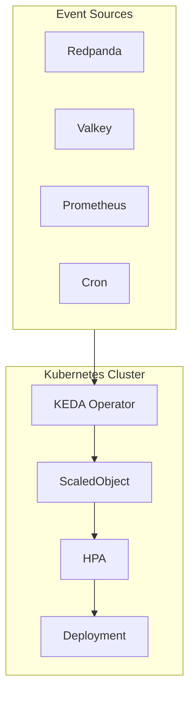
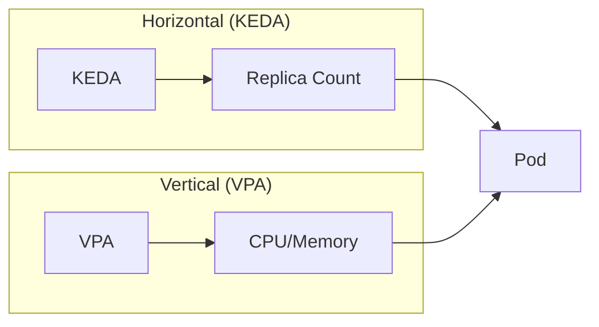

# ADR: Event-Driven Scaling with KEDA

**Status:** Accepted
**Date:** 2024-06-01
**Updated:** 2026-01-16

## Context

Need autoscaling based on event-driven metrics beyond CPU/memory.

## Decision

Use **KEDA** for event-driven horizontal scaling. VPA for vertical scaling is managed separately.

## Architecture



## Rationale

| Feature | HPA | KEDA |
|---------|-----|------|
| CPU/Memory scaling | Yes | Yes |
| Custom metrics | Limited | Yes |
| Event-driven | No | Yes |
| Scale-to-zero | No | Yes |
| Queue-based | No | Yes |

**Key Decision Factors:**
- Scale-to-zero for cost savings
- Queue-based scaling for workers
- Integrates with Redpanda and Valkey

## Configuration

### Queue-Based Scaling (Valkey)

```yaml
apiVersion: keda.sh/v1alpha1
kind: ScaledObject
metadata:
  name: <tenant>-worker
  namespace: <tenant>-prod
spec:
  scaleTargetRef:
    name: <tenant>-worker
  minReplicaCount: 0
  maxReplicaCount: 10
  triggers:
    - type: redis
      metadata:
        address: valkey.databases:6379
        listName: <tenant>-job-queue
        listLength: "5"
```

### Kafka/Redpanda Scaling

```yaml
apiVersion: keda.sh/v1alpha1
kind: ScaledObject
metadata:
  name: <tenant>-consumer
  namespace: <tenant>-prod
spec:
  scaleTargetRef:
    name: <tenant>-consumer
  minReplicaCount: 0
  maxReplicaCount: 20
  triggers:
    - type: kafka
      metadata:
        bootstrapServers: redpanda.databases:9092
        consumerGroup: <tenant>-consumer
        topic: <tenant>.events
        lagThreshold: "100"
```

### Prometheus Metrics Scaling

```yaml
apiVersion: keda.sh/v1alpha1
kind: ScaledObject
metadata:
  name: <tenant>-api
  namespace: <tenant>-prod
spec:
  scaleTargetRef:
    name: <tenant>-api
  minReplicaCount: 2
  maxReplicaCount: 10
  triggers:
    - type: prometheus
      metadata:
        serverAddress: http://mimir.observability:9090
        query: sum(rate(http_requests_total{app="<tenant>-api"}[2m]))
        threshold: "100"
```

## Scaling Patterns

| Workload | Strategy | Scaler | Min | Max |
|----------|----------|--------|-----|-----|
| API | Request-based | Prometheus | 2 | 10 |
| Workers | Queue-based | Redis/Kafka | 0 | 10 |
| Consumers | Lag-based | Kafka | 0 | 20 |
| Background | Cron-based | Cron | 0 | 1 |

## KEDA + VPA Relationship



- **KEDA**: Horizontal scaling (replica count)
- **VPA**: Vertical scaling (resource requests) - see [ADR-VPA](../../vpa/docs/ADR-VPA.md)

## Consequences

**Positive:**
- Scale-to-zero for cost savings
- Event-driven scaling
- Integrates with Redpanda/Valkey

**Negative:**
- Additional component to manage
- ScaledObject per workload

## Related

- [ADR-VPA](../../vpa/docs/ADR-VPA.md)
- [ADR-EVENT-STREAMING-REDPANDA](../../redpanda/docs/ADR-EVENT-STREAMING-REDPANDA.md)
- [ADR-CACHING-VALKEY](../../valkey/docs/ADR-CACHING-VALKEY.md)
